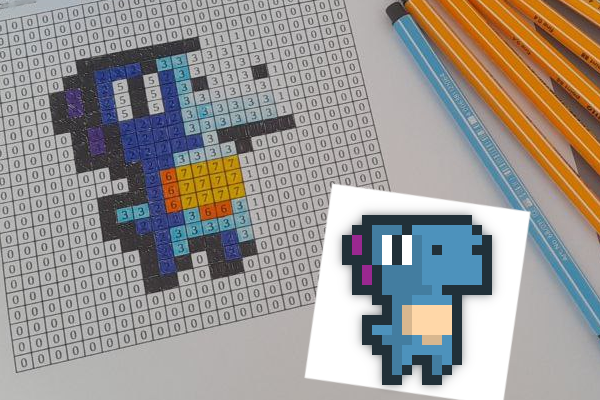

Pix2Paper
===

A small tool to convert pixel art into a printable table to color.

If you are just interested in the some tables to print and paint, check the [print/](print/) folder!
Feel free to add your pixel art :smile: ! (must be free)

### Example

> $ python3 pix2paper.py -i examples/example1.png

Pixel art source: https://arks.itch.io/dino-characters
https://twitter.com/ScissorMarks

### Pixel art credits

- https://arks.itch.io/dino-characters
- https://ninjikin.itch.io/fruit
